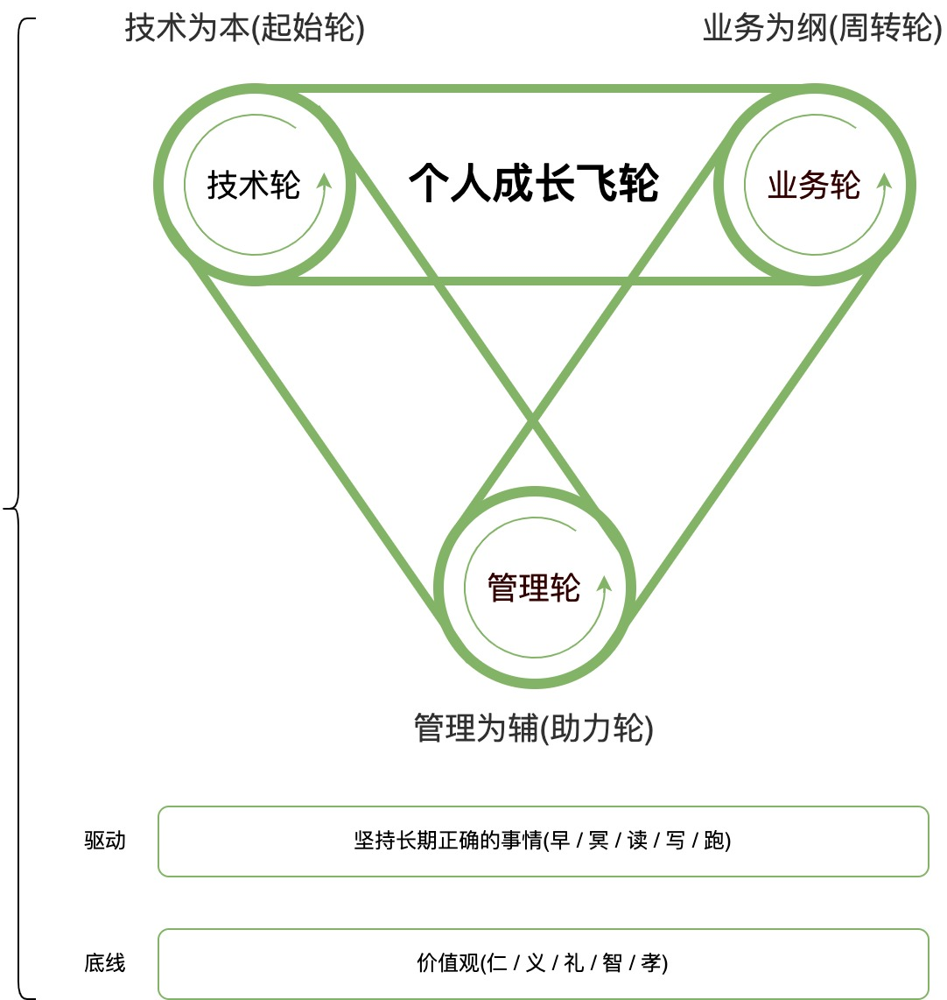
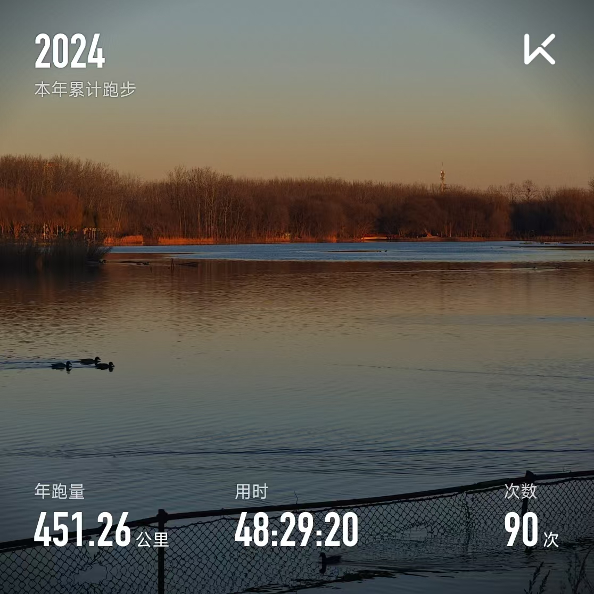
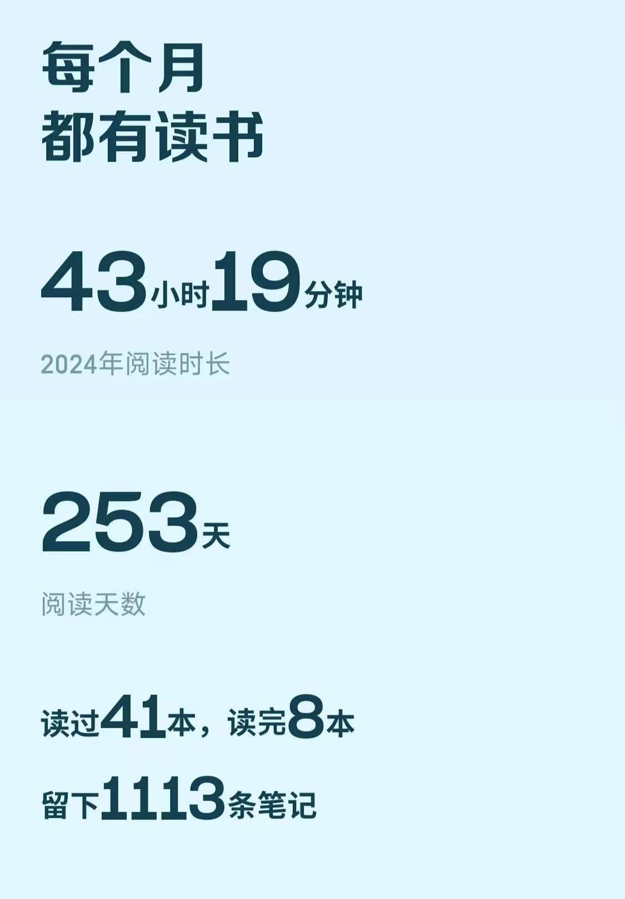

# 一段马斯克的经典采访

开启本文前，先看一段简短的马斯克采访：

有人提问马斯克：“你人生中遇到最大的挑战是什么？”

马斯克思索片刻后说：“确保你能有纠错反馈循环，然后能够持续保持这个循环，即便是别人对你不敢说忠言的时候。”

当年第一次刷到这个视频印象特别深刻，觉着这个“纠错反馈循环”很酷，但实际在脑海里没什么概念。

但是今天，我初步构建出属于自己的“纠错反馈循环”，这是我2024年最大的收获之一。

# 我的“纠错反馈循环”

我的“纠错反馈循环”，我称之为“个人成长飞轮体系”，如下图所示：

  

<!-- 

  

 -->

我的个人成长飞轮分三层，心下向上分别是：

+ 1. 第一层：永远坚持「价值观」为底线(仁/义/礼/智/孝)
+ 2. 第二层：通过坚持「长期正确的事情」驱动个人不断成长(早/冥/读/写/跑)
+ 3. 第三层：个人成长分为三个维度：技术、业务、管理，分别对应「技术轮」、「业务轮」、「管理论」。
    + 3.1 技术轮：始终坚持技术为本，折腾技术是我兴趣，也是我职业生涯的开端
    + 3.2 管理轮：第1次角色转型，从团队骨干到一线管理者转型。“大约70%技术人都是被迫走向管理”，是的我也是那大约70%分之一
    + 3.3 业务轮：第2次角色转型，从「懂技术、懂管理」的人才向「懂技术、懂管理、懂业务」的复合型人才转型。这次我认识到企业经营原则：销售最大化，费用最小化，帮助我把事情**做好到做对**转型。

## 价值观底线

从稻盛和夫的“作为人何为正确？”，再到冯唐读《资治通鉴》的仁、义、礼、智、孝。强人和历史都在告诉我们“追求有才前，先得有德”，德才兼备，德一定在才的前面。
永远坚持价值观为我们做人的底线，和判定事情的标准。

## 长期正确的事情

坚持长期正确的事情早起、冥想、读书、写作、跑步。

- 今年是坚持跑步的第7个年头，我坚信维持好的身体是所有一切的前提。

  

- 今年是坚持读书的第3个年头，通过读书进行信息输入，驱动个人不断的成长

  

- 今年是坚持写作的第9个年头，通过“输出倒逼输入”，锻炼自己“想清楚”和“结构化思维”的能力，持续不断强制自己去思考。

今年一共写了五篇文章（包含本文）：

1. 《关于新零售的一些思考》
2. 《程序员如何做“好”需求判断？》
3. 《Go的GMP模型真的“简单”》
4. 《职场进阶必会的通用方法论》
5. 《个人成长飞轮体系》

## 技术轮

始终坚持技术为本。

## 管理轮

## 业务轮

1. 通过读书，持续不断提升自己的业务sensor
2. 去“做”：参与到实际的经营中

今年相关年度书籍：

- 稻盛和夫《经营与会计》：稻盛和夫的会计学，帮助你理解会计的本质。
- 刘润《底层逻辑2:理解商业世界的本质》：帮你认识资产负债表、损益表（利润表）
- 刘润《新零售：低价高效的数据赋能之路》：帮你理解什么是新零售。人：通过坪效(互联网销售漏斗公式)革命提升“人效”，货：通过短路经济(商业模式M2b)提升“货效”，场：通过数据赋能(大数据)提升“场效”。
- 袁宝国《拼多多拼什么》：揭秘拼多多c2M的商业模式变革等。
- 张恒、杨永朋《名创优品的101个新零售细节》：爆品经济(供应链优势)，千店千面(数据赋能)。
- 刘杨《觉醒胖东来》：我的飞轮体系启发来源。胖东来飞轮：文化理念(起始轮)，成就阳关个性的生命；分配制度(助力轮)：拿出50%的利润分给员工，企业经营的好坏跟员工收益挂钩；运营系统(周转轮)：标准化运营管理模式和胖东来百科系统。